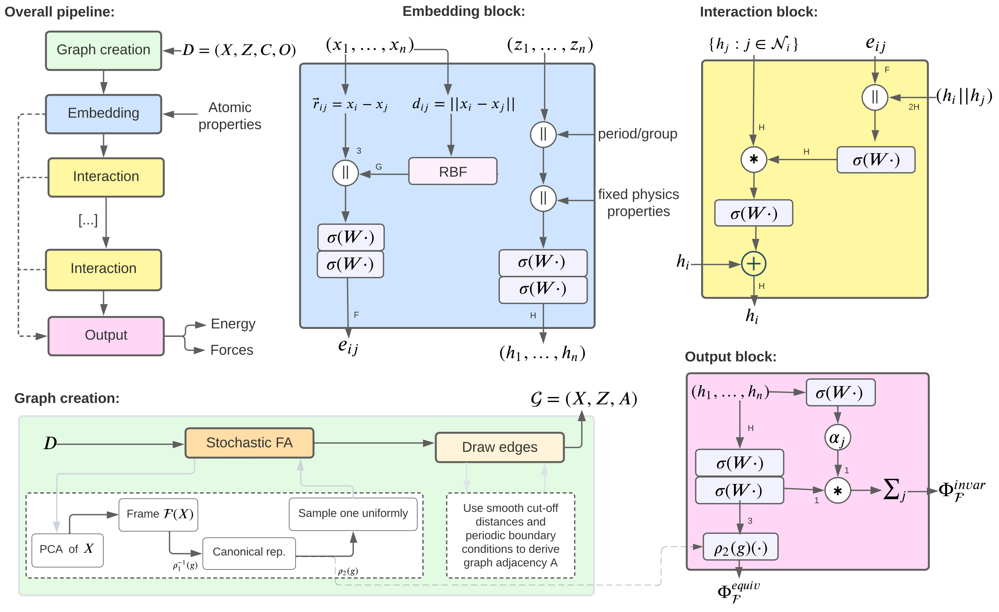

# FAENet

This repository contains the code used to *train* the models reported in [FAENet: Frame Averaging Equivariant GNNs for Materials Modeling](https://openreview.net/forum?id=HRDRZNxQXc).



To re-use components of this work, we recommend using the associated python package:
* 🔥 [**`faenet`**](https://github.com/vict0rsch/faenet) 
  * `faenet.FAENet` implements our efficient GNN model (FAENet)
  * `faenet.FrameAveraging` and `faenet.model_forward` implement (Stochastic) Frame Averaging data transforms and a utility function to average predictions over frames.
This package contains everything you need to re-use FAENet for your specific use-case. 
Additionnally, we also recommend looking at the folllowing package, which contains handy implementations to define atom embeddings and to rewire OC20 graphs:
* ⚡ [**`phast`**](https://github.com/vict0rsch/phast), from [PhAST: Physics-Aware, Scalable, and Task-specific GNNs for Accelerated Catalyst Design](https://arxiv.org/abs/2211.12020)
  * `phast.PhysEmbedding` that allows one to create an embedding vector from atomic numbers that is the concatenation of:
    * A learned embedding for the atom's group and one for the atom's period.
    * A fixed or learned embedding from a set of known physical properties, as reported by `mendeleev`
    * For the OC20 dataset, a learned embedding for the atom's `tag` (adsorbate, catalyst surface or catalyst sub-surface)
  * Tag-based graph rewiring strategies for the OC20 dataset:
    * `remove_tag0_nodes` deletes all nodes in the graph associated with a tag 0 and recomputes edges
    * `one_supernode_per_graph` replaces all tag 0 atoms with a single new atom
    * `one_supernode_per_atom_type` replaces all tag 0 atoms of a given element with its own super node*


## Installation

```bash
# (1.a) ICML version
$ pip install --upgrade torch==1.12.1+cu113 torchvision==0.13.1+cu113 --extra-index-url https://download.pytorch.org/whl/cu113
$ pip install pyg-lib torch-scatter torch-sparse torch-cluster torch-spline-conv torch-geometric -f https://data.pyg.org/whl/torch-1.12.0+cu113.html
# (1.b) Or a more recent
$ pip install torch==1.13.1+cu116 torchvision==0.14.1+cu116 --extra-index-url https://download.pytorch.org/whl/cu116
$ pip install torch_geometric==2.3.0
$ pip install pyg_lib torch_scatter torch_sparse torch_cluster torch_spline_conv -f https://data.pyg.org/whl/torch-1.13.1+cu116.html
# (1.c) Or any compatible version of the above packages

# (2.) Then
$ pip install ase dive-into-graphs e3nn h5py mendeleev minydra numba orion Cython pymatgen rdkit rich scikit-learn sympy tqdm wandb tensorboard lmdb pytorch_warmup ipdb orjson
$ git clone https://github.com/icanswim/cosmosis.git cosmosis # For the QM7X dataset
```

## 🌟 To run the code 🌟

### TL;DR

1. Update the paths where the data is stored in `configs/models/tasks/${task}.yaml`
2. Check out flags in `ocpmodels/common/flags.py`, especially those related to Weights and Biases
3. Run `python main.py --config=${model}-${task}-${split}` to train a model on a dataset (see below)
4. Have a look at the example `scripts/submit.sh` to run multi-GPU SLURM jobs

### Configuration

* ⚒️ Specify the base configuration to use from the command-line with **`--config=${model}-${task}-${split}`**
  * `${model}` must listed in `ocpmodels/models/*.py` and the name to use is specified by the `@registry.register_model(${model})`
  * `${task}` can be one of `{is2re, s2ef, qm7x, qm9}`
  * `${split}` is either a pre-defined split (in the case of OC20) or `all` for the `qm*` tasks
  * Examples
    * `--config=faenet-is2re-all`, `--config=faenet-s2ef-2M`, `--config=schnet-qm7x-all` etc.

* 📘 The code will load hyperparameters from `configs/models`, by subsequently merging (deep merge) resulting dictionaries:

  1. An initial `dict` is created from the *default* flag values in `ocpmodels/common/flags.py`
  2. `tasks/${task}.yaml -> default:`
  3. `tasks/${task}.yaml -> ${split}:`
  4. `${model}.yaml -> default:`
  5. `${model}.yaml -> ${task}:default:`
  6. `${model}.yaml -> ${task}:${split}:`, (e.g. in configs/models/faenet.yaml default:is2re:all)
  7. Lastly, any command-line arg will override the configuration.

* 📙 The default parameters for a given `${model}-${task}-${split}` reflect the results in the papers.
* 📗 The main namespaces for hyperparameters are:
  * `--model.*` to define the model specific HPs (`num_gaussians`, `num_interactions` etc.)
  * `--optim.*` to define the optimization's HPs (`batch_size`, `lr_initial` `max_epochs` etc.)
  * `--dataset.*` to define data attributes (`default_val`, `${split}.src` etc.)
* 🔧 **Override any hyperparameter from the command-line** (including nested keys) `--nested.key=value`
  * Example: `python main.py --config=faenet-is2re-all --model.hidden_channels=256 --optim.max_epochs=10 --fa_method=all`
* 📚 So you should check `flags.py`, `configs/models/${model}.yaml` to see all hyperparameters. Thorough documentation is provided in the model class docstring (e.g. ocpmodels/models/faenet.py)


## Structure of the Repo 🏗

* 🕸 `\ocpmodels`: This directory contains most core functions of the repo.
  * `\trainers`: Code backbone for model training, evaluation, etc.
  * `\models`: Definitions of various GNN models in `model_name.py`files.
  * `\datasets`: Tools and transforms related to datasets.
  * `\modules`: Miscellaneous components (e.g., loss functions, evaluators, normalizers).
  * `\preprocessing`: Key data processing functions (e.g., graph rewiring, frame averaging).

* 🖇 `\configs`: This directory contains hyperparameters. 
  * `\models`: Default model parameters.
  * `\exps`: Examples of runs that we have launched.

* 🌈 `\notebooks`: Jupyter notebooks from the original OCP repo to help you understand the dataset.

* 🎳 `\mila`: Contains scripts for launching runs on the Mila cluster.

* 🎯 `\scripts`: Contains several useful scripts that you can run directly. Some download the data, some compute data properties or inference times. For example:
  * `test_all.py` and `test_faenet.py` run quick tests to ensure the proper functioning of various configurations. (run python scripts/test_all.py)
  * `gnn_dev.py` is a debugging tool (e.g. with Visual Studio Code Debugger).


### Usage Examples

* Run directly on computing resource: `python main.py --config=faenet-is2re-10k --optim.batch_size=128 --optim.eval_batch_size=128`
* Run on login node of your cluster: `sbatch scripts/submit_example.sh`, making sure to replace relevant components. Check `scripts/submit.sh` for a more general script.

To launch multiple jobs at the same time, we have used the following scripts, adapted to our Mila cluster. 
  * `python mila/launch_exp.py exp=test`, where the run configs are specified in the folder `configs/exps/test.yaml`. 
  * `python mila/sbatch.py mem=48GB cpus=4 gres=gpu:1 job_name=jmlr exp_name=jmlr/last-runs py_args=--test_ri=True --cp_data_to_tmp_dir=True --mode='train' --wandb_tags='test-run' --optim.force_coefficient=50 --config='faenet-s2ef-2M' --note='FAENet baseline' --model.regress_forces='direct'` where the run configs are specified in the folder `configs/exps/test.yaml`.

❗️ Before running the scripts, make sure to (1) install the required dependencies (2) follow TL;DR instructions (3) target the right compute environement (gpu, cluster) (4) you have taken care of loggers. Also, remember that you could use the FAENet package directly to utilise the model and frame averaging directly. 


### License

This project is licensed under the [License Name](link_to_license).
