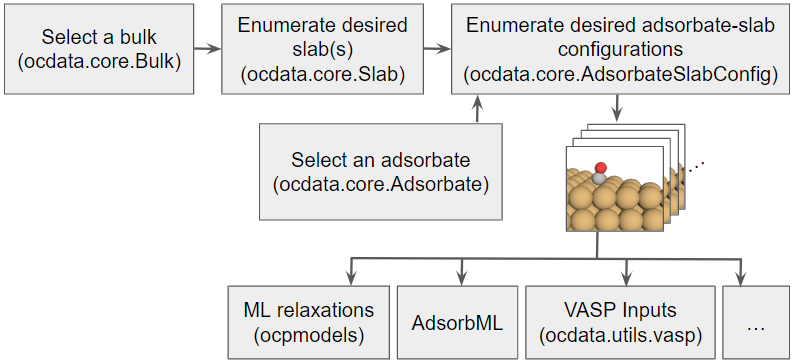

[](https://dl.circleci.com/status-badge/redirect/gh/Open-Catalyst-Project/Open-Catalyst-Dataset/tree/main)
[](https://codecov.io/gh/Open-Catalyst-Project/Open-Catalyst-Dataset/tree/main)

# Open-Catalyst-Dataset

This repository hosts the adsorbate-catalyst input generation workflow used in the [Open Catalyst Project](https://opencatalystproject.org/).

## Setup

The easiest way to install prerequisites is via [conda](https://conda.io/docs/index.html). After installing [conda](http://conda.pydata.org/), run the following commands:

* Create a new environment: `conda create -n ocp python=3.9`
* Activate the newly created environment: `conda activate ocp`
* Install specific versions of Pymatgen and ASE: `pip install pymatgen==2023.5.10 ase==3.22.1`
* Clone this repo and install with: `pip install -e .`

## Workflow

The codebase supports the following workflow to generate adsorbate-catalyst input configurations.

1. Initialize a bulk:
    - By providing an atoms object, or
    - By `bulk_id` (e.g. `mp-30`), or
    - By its index in the database, or
    - By selecting randomly.
2. Initialize an adsorbate:
    - By providing an atoms object, or
    - By its SMILES string (e.g. `*H`), or
    - By its index in the database, or
    - By selecting randomly.
3. Enumerate slabs from the `Bulk` class.<br>
This internally uses [`pymatgen.core.surface.SlabGenerator`](https://pymatgen.org/pymatgen.core.surface.html#pymatgen.core.surface.SlabGenerator) and supports the following:
    - All slabs up to a specified miller index, or
    - A random slab among those enumerated by the previous method, or
    - A specific miller index.
4. Place the adsorbate on the slab.<br>
This broadly has two steps -- identifying a binding site on the surface of the slab,
and orienting the adsorbate before placing it at that site. We use custom code inspired by `pymatgen` to do this. There are 3 modes: `heuristic`, `random`, and `random_site_heuristic_placement`.
    - Identifying a binding site: First, a Delaunay meshgrid is constructed with surface atoms as nodes. For `heuristic`, the sites considered are on the node (atop), between 2 nodes (bridge) and in the center of the triangle (hollow). For `random` and `random_site_heuristic_placement`, positions of the sites are uniformly randomly sampled along the Delaunay triangles.
    - Adsorbate orientation: For `heuristic` and `random_site_heuristic_placement`, the adsorbate is uniformly randomly rotated around the `z` direction, and provided a slight wobble around `x` and `y`, which amounts to randomized tilt within a certain cone around the north pole. For `random`, the adsorbate is uniformly randomly rotated about its center of mass along all directions.
    - Binding atom: The adsorbate database includes information about which atoms are expected to bind. For `heuristic` and `random_site_heuristic_placement`, the binding atom of the adsorbate is placed at the site, whereas for `random` the center of mass of the adsorbate is placed at the site.



## Usage
Here is a simple example using the `ocdata` workflow to place CO on Cu (1,1,1):

```python
bulk_src_id = "mp-30"
adsorbate_smiles = "*CO"

bulk = Bulk(bulk_src_id_from_db=bulk_src_id, bulk_db_path="your-path-here.pkl")
adsorbate = Adsorbate(adsorbate_smiles_from_db=adsorbate_smiles, adsorbate_db_path="your-path-here.pkl")
slabs = Slab.from_bulk_get_specific_millers(bulk=bulk, specific_millers=(1,1,1))

# Perform heuristic placements
heuristic_adslabs = AdsorbateSlabConfig(slabs[0], adsorbate, mode="heuristic")

# Perform random site, heuristic placements
random_adslabs = AdsorbateSlabConfig(slabs[0], adsorbate, mode="random_site_heuristic_placement", num_sites=100)
```

If you want to use a bulk and/or adsorbate that is not in the database here, you may supply your own `ase.Atoms` object:

```python
bulk = Bulk(bulk_atoms=your_adsorbate_atoms)
adsorbate = Adsorbate(adsorbate_atoms=your_adsorbate_atoms)
slabs = Slab.from_bulk_get_all_slabs(bulk)

# Perform fully random placements
random_adslabs = AdsorbateSlabConfig(slabs[0], adsorbate, mode="random", num_sites=100)
```

If you would like to randomly choose a bulk, adsorbate, and slab:

```python
bulk = Bulk()
adsorbate = Adsorbate()
slab = Slab.from_bulk_get_random_slab(bulk)

# Perform fully random placements
random_adslabs = AdsorbateSlabConfig(slab, adsorbate, mode="random", num_sites=100)
```


## StructureGenerator API

We also provide a `StructureGenerator` helper class that wraps the core functionality described above for creating bulk/slab/adsorbate objects, and writing vasp input files and metadata for multiple placements of the adsorbate on the slab. There are a number of options to configure input generation to suit different usecases. We list a few examples here.

### Command Line Args

#### Input files:

- `--bulk_db` (required): path to the bulk database file
- `--adsorbate_db`: path to the adsorbate database file - required if adsorbate placement is to be performed.
- `--precomputed_slabs_dir`: path to the precomputed slab directory, which saves cost/time if the slabs for each bulk have already been enumerated.

#### Bulk / Slab / Adsorbate specification

Option 1: provide indices. All three must be provided to generate adsorbate-slab configurations, otherwise only slab enumeration will be performed.
- `--adsorbate_index`: index of the desired adsorbate in the database file.
- `--bulk_index`: index of the desired bulk
- `--surface_index`: index of the desired surface

Option 2: provide a set of indices (one of the following)
- `--indices_file`: a file containing strings with the following format `f"{adsorbate_idx}_{bulk_idx}_{surface_idx}"`. This will enumerate slabs as well as adsorbate-slab configurations.
- `--bulk_indices_file`: a file containing bulk indices. This will only do slab enumeration.

#### Slab enumeration

- `--max_miller`: the max miller index of slabs to be generated (i.e. 1, 2, or 3)

#### Adsorbate Placement

- `--seed`: random seed for sampling/random sites generation.
- `--heuristic_placements`: to be provided if heuristic placements are desired.
- `--random_placements`: to be provided if random sites are desired. You may do both heuristic and random placements in the same run.
- `--full_random_rotations`: to be provided in addition to `--random_placements` if fully random placements are desired, as opposed to small wobbles around x/y axis.
- `--random_sites`: the number of sites per slab, which should be provided if `--random_placements` are used.
- `--num_augmentations`: the number of random adsorbate configurations per site (defaults to 1).

#### Multiprocessing, when given a file of indices

- `--chunks`: for multi-node processing, number of chunks to split inputs across.
- `--chunk_index`: for multi-node processing, index of chunk to process.
- `--workers`: number of workers for multiprocessing within one job

#### Outputs

- `--output_dir`: directory to save outputs
- `--no_vasp`: for VASP input files, only write POSCAR and do not write INCAR, KPOINTS, or POTCAR
- `--verbose`: if detailed info should be logged

### Usage

```bash
python structure_generator.py \
  --bulk_db databases/pkls/bulks.pkl \
  --adsorbate_db databases/pkls/adsorbates.pkl  \
  --output_dir outputs/ \
  --adsorbate_index 0 \
  --bulk_index 0 \
  --surface_index 0 \
  --heuristic_placements
```

```
python structure_generator.py \
  --bulk_db databases/pkls/bulks.pkl \
  --adsorbate_db databases/pkls/adsorbates.pkl  \
  --indices_file your_index_file.txt \
  --seed 0 \
  --random_placements \
  --random_sites 100

```

## Databases for bulks and adsorbates

### Bulks

A database of bulk materials taken from existing databases (i.e. Materials Project) and relaxed with consistent RPBE settings may be found in `ocdata/databases/pkls/bulks.pkl`. To preview what bulks are available, view the corresponding mapping between indices and bulks (bulk id and composition): https://dl.fbaipublicfiles.com/opencatalystproject/data/input_generation/mapping_bulks_2021sep20.txt

### Adsorbates

A database of adsorbates may be found in `ocdata/databases/pkls/adsorbates.pkl`. Alternatively, it may be downloaded using the following link:
The latest version is https://dl.fbaipublicfiles.com/opencatalystproject/data/input_generation/adsorbate_db_2021apr28.pkl (MD5 checksum: `975e00a62c7b634b245102e42167b3fb`).
To preview what adsorbates are available, view the corresponding mapping between indices and adsorbates (SMILES): https://dl.fbaipublicfiles.com/opencatalystproject/data/input_generation/mapping_adsorbates_2020may12.txt


## Previous snapshots of the codebase

- [OC20](https://arxiv.org/abs/2010.09990) was generated with an older version of the bulks and this repository. If you would like to exactly reproduce that work, see [`README_legacy_OC20.md`](https://github.com/Open-Catalyst-Project/Open-Catalyst-Dataset/blob/main/README_legacy_OC20.md).
- [OC22](https://arxiv.org/abs/2206.08917) was generated from the [`OC22_dataset`](https://github.com/Open-Catalyst-Project/Open-Catalyst-Dataset/tree/OC22_dataset/ocdata/oc22_dataset) branch of this repository.

## License
`ocdata` is released under the [MIT](https://github.com/Open-Catalyst-Project/Open-Catalyst-Dataset/blob/main/LICENSE.md) license.


## Citation

If you use this codebase in your work, please consider citing:

```
@article{ocp_dataset,
    author = {Chanussot*, Lowik and Das*, Abhishek and Goyal*, Siddharth and Lavril*, Thibaut and Shuaibi*, Muhammed and Riviere, Morgane and Tran, Kevin and Heras-Domingo, Javier and Ho, Caleb and Hu, Weihua and Palizhati, Aini and Sriram, Anuroop and Wood, Brandon and Yoon, Junwoong and Parikh, Devi and Zitnick, C. Lawrence and Ulissi, Zachary},
    title = {Open Catalyst 2020 (OC20) Dataset and Community Challenges},
    journal = {ACS Catalysis},
    year = {2021},
    doi = {10.1021/acscatal.0c04525},
}
```

The Open Catalyst 2020 (OC20) and Open Catalyst 2022 (OC22) datasets are licensed under a [Creative Commons Attribution 4.0 License](https://creativecommons.org/licenses/by/4.0/legalcode).
