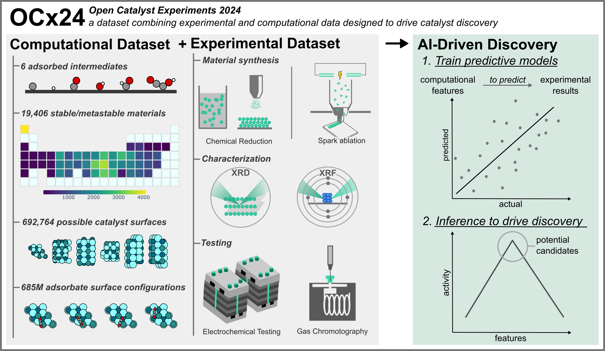

## Open Catalyst Experiments 2024 (OCx24): Bridging Experiments and Computational Models

In this work, we seek to directly bridge the gap between computational descriptors and experimental outcomes for heterogeneous catalysis. We consider two important green chemistries: the hydrogen evolution reaction (HER) and the electrochemical reduction of carbon dioxide (CO2RR). To do this, we created a curated dataset of experimental results with materials synthesized and tested in a reproducible manner under industrially relevant conditions. We used this data to build models to directly predict experimental outcomes using computational features. For more information, please read the manuscript [paper](https://arxiv.org/abs/2411.11783).

### Datasets
All computational and experimental datasets can be accessed [here](data/).

### Analysis
All code related to the training and inference performed in this work can be found [here](analysis/).

### Citing this work

If you use this codebase in your work, please consider citing:

```bibtex
@misc{abed2024opencatalystexperiments2024,
      title={Open Catalyst Experiments 2024 (OCx24): Bridging Experiments and Computational Models}, 
      author={Jehad Abed and Jiheon Kim and Muhammed Shuaibi and Brook Wander and Boris Duijf and Suhas Mahesh and Hyeonseok Lee and Vahe Gharakhanyan and Sjoerd Hoogland and Erdem Irtem and Janice Lan and Niels Schouten and Anagha Usha Vijayakumar and Jason Hattrick-Simpers and John R. Kitchin and Zachary W. Ulissi and Aaike van Vugt and Edward H. Sargent and David Sinton and C. Lawrence Zitnick},
      year={2024},
      eprint={2411.11783},
      archivePrefix={arXiv},
      primaryClass={cond-mat.mtrl-sci},
      url={https://arxiv.org/abs/2411.11783}, 
}
```
