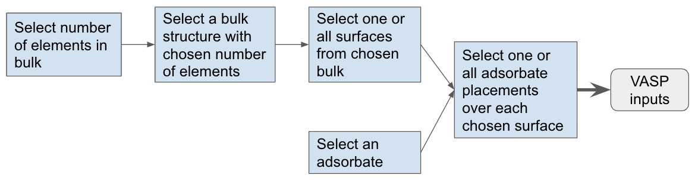

# Open-Catalyst-Dataset

**NOTE**: For the repository to be used as it was for the Open Catalyst 2020 (OC20) dataset, use a version on or before this commit: [17e350](https://github.com/Open-Catalyst-Project/Open-Catalyst-Dataset/commit/17e350e484cf634f750d8764f376e443cc51b60a).

## Setup

The easiest way to install prerequisites is via [conda](https://conda.io/docs/index.html). After installing [conda](http://conda.pydata.org/), run the following commands:

* Create a new environment, `vaspenv`, `conda create -n vaspenv python=3.9`
* Activate the newly created environment to install the required dependencies: `conda activate vaspenv`
* Install specific versions of Pymatgen and ASE: `pip install pymatgen==2020.4.2 ase==3.19.1`
* Install Catkit from Github: `pip install git+https://github.com/ulissigroup/CatKit.git catkit`
* Clone this repo and install with: `pip install -e .`

## Workflow

The codebase supports the following workflow to sample a catalyst+adsorbate system. We start by selecting the number of elements in the bulk material. A bulk structure with this number of elements is selected at random.  A surface is then randomly selected from all symmetrically distinct surfaces from the material with Miller indices less than or equal to 2. A randomly selected adsorbate is then placed over this surface.

In addition to sampling a single catalyst+adsorbate system, we could also enumerate multiple different inputs. At each step, “select” may mean randomly sample or choose a specified object as input by the user, as described in further detail in the next section.



## APIs supported

These are the supported use cases and how to run them:

1. Generate VASP input files for one random adsorbate/bulk/surface/config combination, based on a specified random seed. This follows the workflow described in the diagram above, where every step to “select” a material is randomly sampled. The provided bulk database should be a dict of {number of elements: list of corresponding bulks}. For the following example, files will be in two directories, `outputs/random0/surface/` and `outputs/random0/adslab/`.

```
python sample_structure.py --bulk_db bulk_db_nelems.pkl \
  --adsorbate_db adsorbate_db.pkl  \
  --output_dir outputs/ --seed 0
```

2. Generate one specified adsorbate, one more more specified bulks, and all possible surfaces and configs. The following example generates files for all adsorbate placements of adsorbate 10 on all possible surfaces from bulk 20. Files will be stored in `outputs/10_20_0/surface/`, `outputs/10_20_0/adslab0/`, `outputs/10_20_0/adslab1/`, ..., `outputs/10_20_1/surface/`, `outputs/10_20_1/adslab0/`, and so on for all combinations of surfaces and adsorbate+surface configs. You may also choose multiple bulks (and all of their surfaces and adsorbate+surface configs) by giving a comma separated list of bulk indices.

```
python sample_structure.py --bulk_db bulk_db_flat.pkl \
  --adsorbate_db adsorbate_db.pkl \
  --output_dir outputs/  \
  --enumerate_all_structures \
  --adsorbate_index 10 --bulk_indices 20
```

3. Generate one specified adsorbate, one or more specified bulks, one specified surface, and all possible configs. This is the same as #2 except only one surface is selected, which can be used to help parallelize #2. The following example generates files for all adsorbate placements of adsorbate 10 on surface 0 from bulk 20, resulting in files in `outputs/10_20_0/surface/`, `outputs/10_20_0/adslab0/`, `outputs/10_20_0/adslab1/`, and so on for all the adsorbate+surface configs.

```
python sample_structure.py --bulk_db bulk_db_flat.pkl \
  --adsorbate_db adsorbate_db.pkl --output_dir outputs/
  --enumerate_all_structures --adsorbate_index 10
  --bulk_indices 20 --surface_index 0
```

For any of the above, `--precomputed_structures dir/`  can be added to use the precomputed surfaces rather than calculating all possible surfaces of a given bulk from scratch. Adding `--verbose` will print out additional info.


## Generating inputs for OC20

### Background

We employed the workflow as described above to create the OC20 dataset. We considered bulk materials with up to 3 elements. A total of ~15k bulk structures and 82 adsorbates were considered for sampling. The resulting decision tree was huge since the branching factor at every stage in the workflow is reasonably big. For instance, sampling a surface from a chosen bulk requires considering at most 125 different miller-index calculations. Moreover, placing an adsorbate on a given surface requires enumerating ~30 sites on an average.

We generated around 2.5M adsorbate+catalyst inputs which were then deduplicated before running DFT calculations.  Each input system was generated on a single CPU core with a timeout of 200 minutes.


### Databases for bulk, adsorbate and precomputed surfaces

**Bulks**

Bulk database that is a dict where keys are the number of elements (1-3), and values are lists of bulks, for use case #1 above where we randomly sample a bulk given the number of elements:

* The latest version is https://dl.fbaipublicfiles.com/opencatalystproject/data/input_generation/bulk_db_nelems_2021sep20.pkl (MD5 checksum: `4bb119062019c4624987fa1ac92bd837`)

Flat bulk database (all ~11k bulks in one list), for use cases #2 and #3 above, where we want to retrieve bulks by their index: https://dl.fbaipublicfiles.com/opencatalystproject/data/input_generation/bulk_db_flat_2021sep20.pkl (MD5 checksum: `43df744a8366c25392e3072d445016b2`).

* Corresponding mapping between indices and bulks (MPID and composition): https://dl.fbaipublicfiles.com/opencatalystproject/data/input_generation/mapping_bulks_2021sep20.txt

**Adsorbates**

The latest version is https://dl.fbaipublicfiles.com/opencatalystproject/data/input_generation/adsorbate_db_2021apr28.pkl (MD5 checksum: `975e00a62c7b634b245102e42167b3fb`).
* Corresponding mapping between indices and adsorbates (SMILES): https://dl.fbaipublicfiles.com/opencatalystproject/data/input_generation/mapping_adsorbates_2020may12.txt


**Precomputed surfaces**

To speed up surface sampling from a chosen bulk material we precomputed surface enumerations. These can be found here: https://dl.fbaipublicfiles.com/opencatalystproject/data/input_generation/precomputed_surfaces_2021sep20.tar.gz (5.5GB, MD5 checksum: `f56fe10f380d945d46a1bfab136a4834`)

Note that uncompressing this file will result in the folder `precomputed_surfaces_2021june11/`
(uncompressed size 18GB). It has 11k pickle files, with filename format `<zero-based-index>.pkl`, one for each of the bulk materials based on the bulk indices.


**Note**

OC20 was generated with an older version of the bulks (https://dl.fbaipublicfiles.com/opencatalystproject/data/input_generation/bulk_db_nelems_2020may12.pkl (MD5 checksum: `b87281d01a2006586fa719a1d2ee2682`), which has 50 duplicated bulk entries that are now removed in the latest version, and an older version of the adsorbates (https://dl.fbaipublicfiles.com/opencatalystproject/data/input_generation/adsorbate_db_2020may12.pkl, MD5 checksum: `6c553a7c2009e11612c247ffb813fd74`), which contains an inconsistency that is fixed in the latest version.


### Deduplicating redundant input systems

In order to make sure that we run VASP simulations on unique input systems, we employ a deduplication strategy to detect redundant input systems. To that end, we store a unique string summarizing the traversal on the sampling decision tree as metadata information. Using this unique string, we deduplicate any set of generated inputs comparing them against the previously generated inputs.


### Sample generation for OC20

The structures are sampled randomly as in use case #1 from above. We passed in 0-2500000 as random seeds for the OC20 dataset.

```
python sample_structure.py --bulk_db bulk_db_nelems_2020may12.pkl \
  --adsorbate_db adsorbate_db_2020may12.pkl \
  --precomputed_structures precomputed_structure_info_oc20/
  --output_dir outputs/ --seed 0
```


## Citation

The Open Catalyst 2020 (OC20) dataset is licensed under a [Creative Commons Attribution 4.0 License](https://creativecommons.org/licenses/by/4.0/legalcode). Please cite the following paper in any research manuscript using the OC20 dataset:


```
@misc{ocp_dataset,
    title={The Open Catalyst 2020 (OC20) Dataset and Community Challenges},
    author={Lowik Chanussot* and Abhishek Das* and Siddharth Goyal* and Thibaut Lavril* and Muhammed Shuaibi* and Morgane Riviere and Kevin Tran and Javier Heras-Domingo and Caleb Ho and Weihua Hu and Aini Palizhati and Anuroop Sriram and Brandon Wood and Junwoong Yoon and Devi Parikh and C. Lawrence Zitnick and Zachary Ulissi},
    year={2020},
    eprint={2010.09990},
    archivePrefix={arXiv}
}
```
